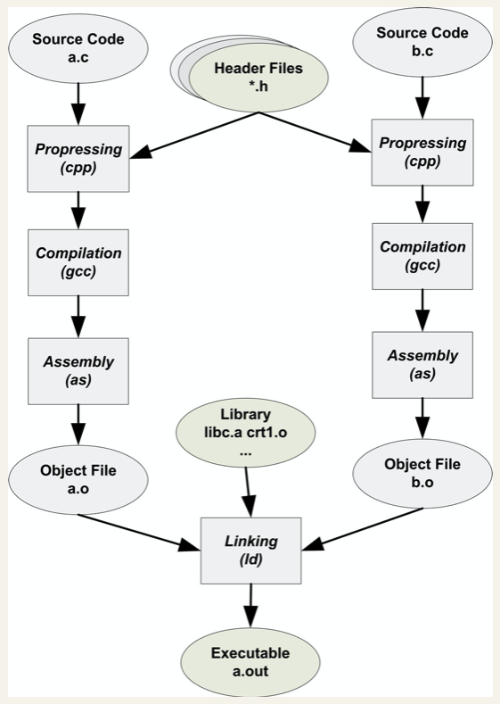

# Build

构建（Build）通常是说编译和链接，可以分解为4个步骤，分别是预处理（Prepressing）、编译（Compilation）、汇编（Assembly）和链接（Linking）。


## 预处理（Prepresssing）

预处理过程主要处理那些源代码文件中的以“#”开头的预编译指令。如下：

* 将所有的“#define”删除，并且展开所有的宏定义。
* 处理所有条件预编译指令，比如“#if”、“#ifdef”、“#elif”、“#else”、“#endif”。
* 处理“#include”预编译指令，将被包含的文件插入到该预编译指令的位置。注意，这个过程是递归进行的，也就是说被包含的文件可能还包含其他文件。
* 删除所有的注释“//”和“/* */”。
* 添加行号和文件名标识，比如#2“hello.c”2，以便于编译时编译器产生调试用的行号信息及用于编译时产生编译错误或警告时能够显示行号。
* 保留所有的#pragma编译器指令，因为编译器需要使用它们。

```bash
$ gcc -E hello.c -o hello.i
```

```bash
$ clang -E hello.m -o hello.i
```


## 编译（Compilation）

编译过程就是把预处理完的文件一系列处理，产生相应的汇编代码文件。

* 词法分析 - 扫描器将源代码作为输入，产生一个个的单词符号。
* 语法分析 - 语法分析器以单词符号作为输入，分析单词符号串是否形成符合语法规则的语法单位。
* 语义分析 - 静态语义分析，通常包含声明和类型的匹配，类型转换，类型推断。
* 中间语言生成 - 中间代码可使编译程序的结构在逻辑上更为简单明确，并且易于`代码优化`。

```bash
$ gcc -S hello.i -o hello.s
// or
$ gcc -S hello.c -o hello.s
```

```bash
$ clang -S hello.i -o hello.s
```


## 汇编（Assembly）

汇编过程就是将汇编代码变成机器可以执行的指令。

* 代码优化 - 对程序进行多种等价变换，能生成更有效的目标代码。
* 目标代码生成 - 目标代码生成是编译的最后一个阶段。目标代码生成器把语法分析后或优化后的中间代码变换成目标代码。
* 模块内变量的地址和空间匹配。

```bash
$ as hello.s -o hello.o
// or
$ gcc -c hello.c -o hello.o
```

```bash
$ clang -c hello.s -o hello.o
```


## 链接（Linking）

链接过程就是处理模块间符号的引用，使得各个模块之间能够正确的衔接。主要包括如下步骤：

* 地址和空间匹配（Address and Storage Allocation）。
* 符号决议（Symbol Resolution）。
* 重定位（Relocation）。

> `符号决议`也称为`符号绑定`，“决议”更倾向于静态链接，“绑定”更倾向于动态链接。
>
> 地址和空间匹配有两个含义，一个是在输出的可执行文件中的空间，另一个是在装载后的虚拟地址中的虚拟地址空间。不过，我们更关注虚拟地址空间分配，这个关系到链接器对于地址的计算。

```bash
$ gcc hello.o -o hello
```

```bash
$ clang hello.o -o hello
```


### 静态链接

链接器以一组可重定位的目标文件作为输入，生成一个完全链接的可以加载和运行的可执行文件。

最基本的静态链接过程如下图所示。每个模块的源代码文件（如.c）文件经过编译器编译成目标文件（Object File，一般扩展名为.o或.obj），目标文件和库（Library）一起链接形成最终可执行文件。




### 动态链接

动态链接的基本思想是把程序按照模块拆分成各个相对独立部分，在程序运行时才将它们链接在一起形成一个完整的程序，而不是像静态链接一样把所有的程序模块都链接成一个个单独的可执行文件。

当程序被装载的时候，系统的动态链接器会将程序所需要的所有动态链接库（最基本的就是libc.so）装载到进程的地址空间，并且将程序中所有未决议的符号绑定到相应的动态链接库中，并进行重定位工作。

地址无关代码（PIC, Position-independent Code）

延迟绑定（Lazy Binding）

